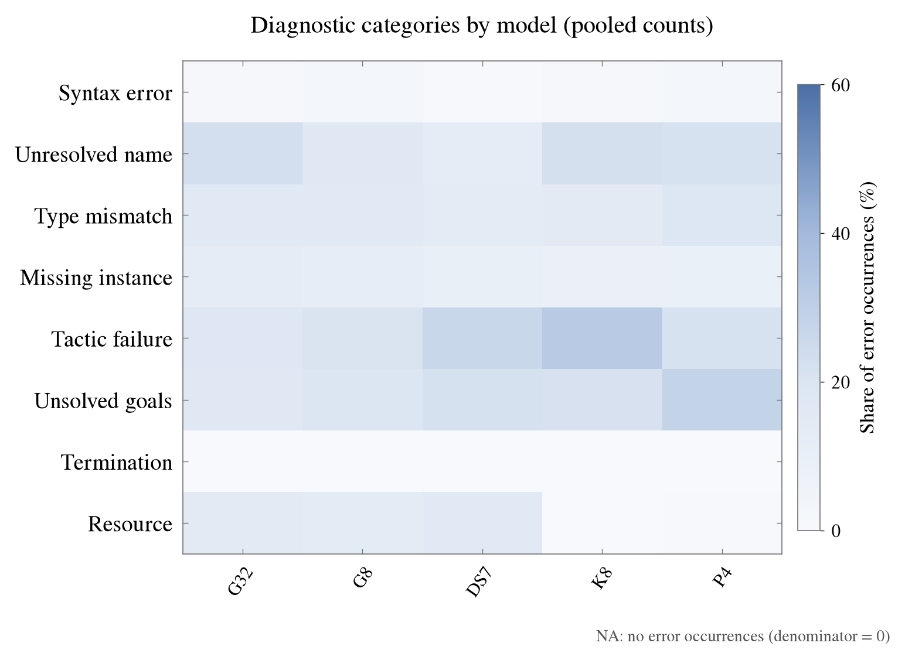
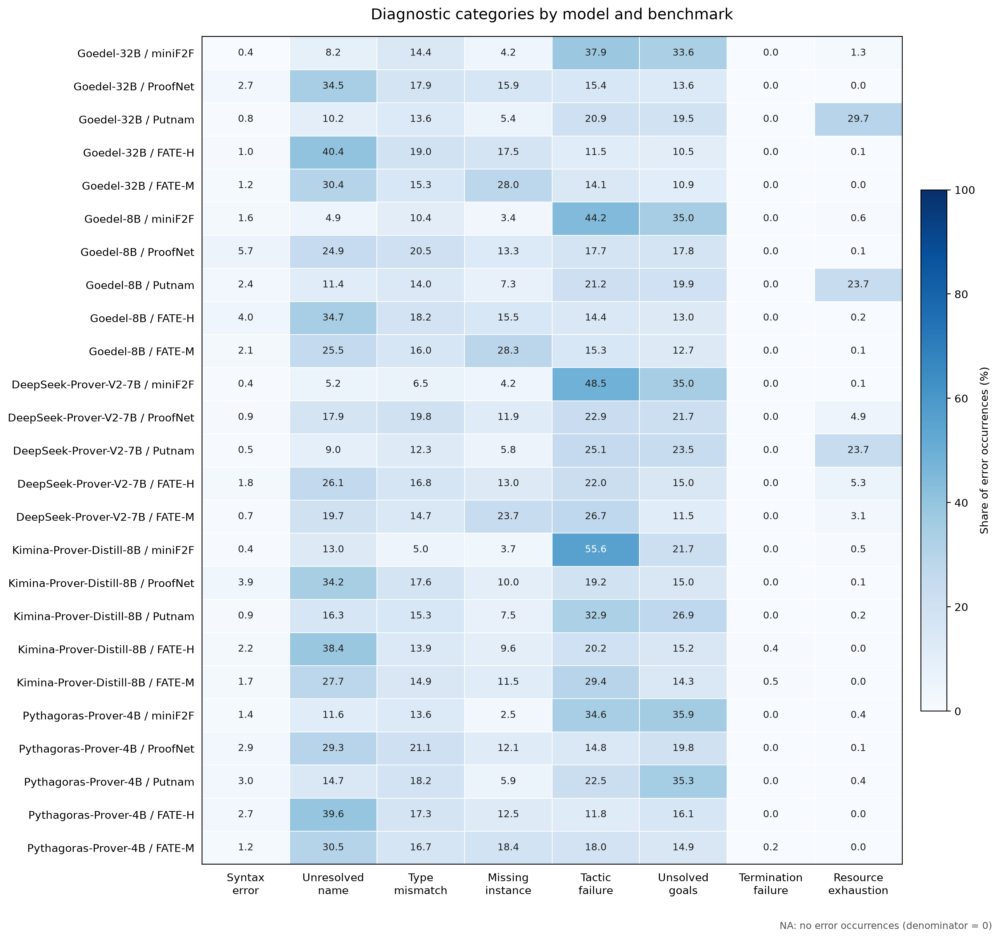

# Analysis results and error explanations

Published results for five models across miniF2F, ProofNet, Putnam, FATE-M and FATE-H (25 model–benchmark cells). The analysis includes all supplied candidates of problems unsolved at Pass@32, after the recorded exclusions. It contains **788,234 parsed diagnostics** and **676,049 counted error occurrences**.

These results use the historical occurrence rule: repeated reports at the same source position with the same diagnostic header count once within a candidate record. Full available messages are retained in the compressed mapping. Each diagnostic receives its own category; a candidate can contribute several categories. The [main README](../README.md) explains parsing limits and all rules.

## File index

| File | Content | Producing script |
|---|---|---|
| [mapped_errors.csv.gz](tables/mapped_errors.csv.gz) | Every distinct complete message per cell, its category/template, diagnostic count and occurrence count; losslessly compressed CSV. | `scripts/summarize_errors.py`, then gzip |
| [template_counts.csv](tables/template_counts.csv) | All positive template frequencies per cell. | `scripts/summarize_errors.py` |
| [top50_errors.csv](tables/top50_errors.csv) | Templates reaching cumulative coverage of at least 50%, including cutoff ties. | `scripts/summarize_errors.py` |
| [top50_summary.csv](tables/top50_summary.csv) | Per-cell eligible denominator, exclusions, selected count and achieved coverage. | `scripts/summarize_errors.py` |
| [categories_by_cell.csv](tables/categories_by_cell.csv) | All eight categories in each of 25 cells: 200 rows. | `scripts/summarize_errors.py` |
| [categories_by_model.csv](tables/categories_by_model.csv) | Counts pooled across benchmarks for each model: 40 rows. | `scripts/summarize_errors.py` |
| [analysis_summary.json](tables/analysis_summary.json) | Counting and ranking policies, source fingerprints, exclusions and all 25 scan summaries. | `scripts/summarize_errors.py` |
| [Cell heatmap PNG](figures/category_heatmap_by_cell.png) / [PDF](figures/category_heatmap_by_cell.pdf) | Category percentages within each model–benchmark cell. | `scripts/plot_heatmaps.py` |
| [Model heatmap PNG](figures/category_heatmap_by_model.png) / [PDF](figures/category_heatmap_by_model.pdf) | Category percentages after pooling benchmark counts per model. | `scripts/plot_heatmaps.py` |

This Markdown guide summarizes the CSVs and links the published outputs. Candidate-level `raw_errors.jsonl` and redundant per-cell message-count CSVs remain local intermediates under `results/scans/`; the published mapping preserves complete distinct messages and both counts by cell. Original verifier inputs and exclusion lists are required to rebuild those intermediates. Their filenames and SHA-256 fingerprints are recorded in `analysis_summary.json`.

## Error definitions and original-output evidence

| Collection | Content |
|---|---|
| [Compiler diagnostic categories](compiler_diagnostics/README.md) | Eight definitions and thesis Table 6.1 examples, with complete model outputs and saved diagnostics. |
| [Mathematical reasoning errors](mathematical_reasoning_errors/README.md) | Three categories with definitions, identified examples, and mathematical derivations or counterexamples. |
| [Plan-to-code errors](plan_to_code_errors/README.md) | Three translation mechanisms with valid local mathematics, original code, and minimal Lean checks of the failure and correction. |

Each category follows **definition → case study → explanation**, with sibling `model_output.txt`, `case_excerpt.md` and `verification.json`. Excerpts are verbatim and preserve relevant self-corrections. These qualitative collections describe separate analytical dimensions; they do not add mathematical or translation frequencies to the compiler tables. A successful minimal Lean correction is not a verified repair of the complete candidate. The original compiler collection was previously named `case_studies/`.

## Figure presentation

Both heatmaps adopt the thesis's muted blue palette, serif labels and category-by-model layout. The cell figure groups model columns by benchmark. G32 = Goedel-32B; G8 = Goedel-8B; DS7 = DeepSeek-Prover-V2-7B; K8 = Kimina-Prover-Distill-8B; P4 = Pythagoras-Prover-4B. The axis labels “Termination” and “Resource” abbreviate Termination failure and Resource exhaustion.

Only presentation follows the thesis. These figures use the full eight-category occurrence counts in the published CSVs, including resource exhaustion and `no goals to be solved`; they do not use the thesis's candidate-level primary labels or seven-category denominator. Both figures share a 0–60% color scale, covering every value; the plotting command rounds the joint maximum up to the next ten percentage points. Exact percentages are available in the linked tables.

## Pooled model distributions

Percentages below use each model's total error occurrences across the five benchmarks. They measure the composition of retained compiler errors, not proof success rates. Benchmark contributions are weighted by their occurrence counts. Values are rounded to two decimals here; the CSVs retain six decimals.

| Model | Occurrences | Syntax error | Unresolved name | Type mismatch | Missing instance | Tactic failure | Unsolved goals | Termination failure | Resource exhaustion |
|---|---:|---:|---:|---:|---:|---:|---:|---:|---:|
| DeepSeek-Prover-V2-7B | 65,923 | 0.68% | 12.73% | 13.84% | 9.61% | 26.22% | 21.76% | 0.00% | 15.15% |
| Goedel-32B | 249,899 | 1.24% | 22.73% | 15.62% | 12.46% | 17.78% | 16.02% | 0.00% | 14.14% |
| Goedel-8B | 182,067 | 2.96% | 17.03% | 15.47% | 11.53% | 20.30% | 18.71% | 0.01% | 13.99% |
| Kimina-Prover-Distill-8B | 44,140 | 1.47% | 21.84% | 14.27% | 8.33% | 32.30% | 21.52% | 0.12% | 0.15% |
| Pythagoras-Prover-4B | 134,020 | 2.48% | 21.12% | 17.86% | 8.80% | 21.18% | 28.27% | 0.03% | 0.25% |



## Per-cell scope and counts

Scope counts follow each adapter's problem identity and exclusions. In particular, Putnam exclusions and the two ProofNet grouping conventions must be considered when comparing cells. A candidate without a retained compiler diagnostic is not necessarily successful.

| Model | Benchmark | Problems in scope | Candidates in scope | Parsed diagnostics | Error occurrences |
|---|---|---:|---:|---:|---:|
| DeepSeek-Prover-V2-7B | FATE-H | 98 | 3,136 | 7,381 | 3,914 |
| DeepSeek-Prover-V2-7B | FATE-M | 92 | 2,944 | 9,205 | 8,971 |
| DeepSeek-Prover-V2-7B | ProofNet | 146 | 4,672 | 11,670 | 11,300 |
| DeepSeek-Prover-V2-7B | Putnam | 533 | 17,056 | 68,062 | 37,665 |
| DeepSeek-Prover-V2-7B | miniF2F | 63 | 2,016 | 18,228 | 4,073 |
| Goedel-32B | FATE-H | 96 | 3,072 | 73,873 | 41,748 |
| Goedel-32B | FATE-M | 85 | 2,720 | 32,081 | 31,855 |
| Goedel-32B | ProofNet | 144 | 4,608 | 51,751 | 51,239 |
| Goedel-32B | Putnam | 532 | 17,024 | 122,704 | 118,779 |
| Goedel-32B | miniF2F | 32 | 1,024 | 7,100 | 6,278 |
| Goedel-8B | FATE-H | 98 | 3,136 | 29,841 | 15,391 |
| Goedel-8B | FATE-M | 92 | 2,944 | 24,507 | 24,327 |
| Goedel-8B | ProofNet | 155 | 4,960 | 27,974 | 27,703 |
| Goedel-8B | Putnam | 550 | 17,600 | 112,607 | 106,831 |
| Goedel-8B | miniF2F | 43 | 1,376 | 7,957 | 7,815 |
| Kimina-Prover-Distill-8B | FATE-H | 99 | 3,168 | 2,380 | 2,371 |
| Kimina-Prover-Distill-8B | FATE-M | 128 | 4,096 | 9,131 | 9,105 |
| Kimina-Prover-Distill-8B | ProofNet | 163 | 5,312 | 5,825 | 5,798 |
| Kimina-Prover-Distill-8B | Putnam | 552 | 17,664 | 23,181 | 21,784 |
| Kimina-Prover-Distill-8B | miniF2F | 63 | 2,016 | 6,739 | 5,082 |
| Pythagoras-Prover-4B | FATE-H | 99 | 3,168 | 11,473 | 11,424 |
| Pythagoras-Prover-4B | FATE-M | 122 | 3,904 | 18,376 | 18,138 |
| Pythagoras-Prover-4B | ProofNet | 168 | 5,376 | 23,349 | 23,164 |
| Pythagoras-Prover-4B | Putnam | 559 | 17,888 | 65,262 | 64,329 |
| Pythagoras-Prover-4B | miniF2F | 52 | 1,664 | 17,577 | 16,965 |



## Top50 interpretation

Top50 selects frequent **templates** separately for each cell until cumulative coverage reaches at least 50%; every template tied at the cutoff is included. The published historical policy excludes resource exhaustion and `no goals to be solved` from this ranking and its denominator. All eight categories remain included in the category tables and heatmaps. The ranking denominators and achieved coverage are available in `top50_summary.csv`.

## Read and reproduce

From the repository root, extract the full-message mapping without removing the compressed copy:

```bash
gzip -dc results/tables/mapped_errors.csv.gz > results/tables/mapped_errors.csv
```

Or read it directly in Python (some full messages exceed the default CSV field limit):

```python
import csv
import gzip
import sys

csv.field_size_limit(sys.maxsize)
with gzip.open("results/tables/mapped_errors.csv.gz", "rt", encoding="utf-8", newline="") as handle:
    for row in csv.DictReader(handle):
        # row contains the complete message, category, template and both counts.
        pass
```

To redraw both heatmaps from the published tables:

```bash
python3 -m pip install -r requirements.txt
python3 scripts/plot_heatmaps.py --input-dir results/tables --output-dir results/figures
```

Follow the [pipeline commands](../README.md#install-and-run) to rescan original verifier artifacts and rebuild all tables. After regenerating the mapping, prepare its compressed publication copy with:

```bash
gzip -n -c results/tables/mapped_errors.csv > results/tables/mapped_errors.csv.gz
```
